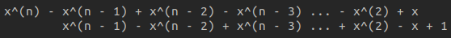
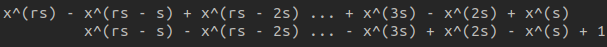

# Number theory interlude 2

  This article extends [https://github.com/Z323323/Number-theory-interlude-1].

## Solovay-Strassen test

  To fully understand this section you should have read [https://github.com/Z323323/Quadratic-residues].
  
  I won't delve this test, since this test is worse than Miller-Rabin's and the linked resource is self-explainatory. Just note that everything reduces to

  $\displaystyle (\frac{b}{r})$

  which has $1/2$ probability of pass the test, thus ~half of the times a Carmichael number will fool this test too.

## $\sum_{d | n} \phi(d) = n$

  Refer to [https://crypto.stanford.edu/pbc/notes/numbertheory/mult.html].

#### Proof

You can find the proof at [https://crypto.stanford.edu/pbc/notes/numbertheory/cyclic.html] but I'm bringing it back here using different words and providing an example to show the actual power of this theorem.

The crazy intuition is considering $n$ as the order of a multiplicative group. This means that

$\phi(z) = n$

We know that every multiplicative subgroup of $Z_{z}^{\ast}$ will have order $o$ such that

$o | n$

This means that finding $\sum_{d | n} \phi(d)$, means finding the number of generators for every subgroup, (refer to 'Generators theorem' section at [https://github.com/Z323323/Group-theory-elements/blob/main/README.md]) and this in turn means that we are finding the whole number of subgroups. Since the whole number of subgroups equals $n$, the theorem follows.

These proofs really blow my mind since they prove such a complex theorem in such a quick way. 

Since this proof is quite unbelievable at first (note that the proof for 'Generators theorem' I linked has been refined after this one, hence why I was shocked about this theorem), I'm providing a quick example below. Let $Z_{41}^{\ast}$, then

$n = \phi(41) = 40$

Initially we can recognise that $\phi(40)$ should be the number of generators, and following this theorem we get that there are $\phi(2^35) = \phi(2^3)\phi(5) = 4*4 = 16$. Indeed if you shoot my Zn.py you'll notice that there exist exactly $16$ generators for $Z_{41}^{\ast}$, but this theorem allows us to get a new power, that is, taking a random $d$, like $10$, we get

$\phi(10) = \phi(2)\phi(5) = 4$

Remember that we will need to only consider the subgroups having exactly an order $o = 10$, since we will find $1$ at the the $10t\lambda$ position for subgroups having $o = 2$ and $o = 5$. If you check this result you will find out that it's correct, hence now we can immediately know how many subgroups exist for a given order $o | n$.

## Perfect Numbers

  Refer to [https://crypto.stanford.edu/pbc/notes/numbertheory/mult.html].
  
  First, we define the Sigma function on any positive integer $n$ as the sum of every divisor $d$ of $n$ such that $d \leq n$, and we write it as $\sigma(n)$.

  Second, we define the Perfect Numbers $n$ as the positive integers such that

  $\sigma(n) = 2n$

  [The first $4$ Perfect Numbers are $6, 28, 496, 8128$.]

  Let $n$ an even perfect number; we define it as

  $n = 2^{q - 1}m$

  which is a safe general form. Now if $n$ is a Perfect Number then

  $2^{q}m = 2n = \sigma(n) = \sigma(2^{q - 1})\sigma(m)$

  because the Sigma function is multiplicative. Then

  $\sigma(2^{q - 1})\sigma(m) = (2^{q} - 1)\sigma(m)$

  This step is not simple at first but if you have familiarity with binary operations this will be quite easy. Just imagine $2^{q - 1}$ in binary format, the divisors of it will simply be every power of $2$ from $2^{q - 1}$ to $2^{0}$. This means that you can easily imagine those bits added sum up to $2^{q} - 1$.

  Now we can note that starting from $2^{q}m$ we got $(2^{q} - 1)\sigma(m)$, and $2^{q} | 2^{q}m$, therefore we necessarily have $2^{q} | (2^{q} - 1)\sigma(m)$ hence

  $\sigma(m) = 2^{q}s$

  This means that

  $(2^{q} - 1)\sigma(m) = (2^{q} - 1)2^{q}s$

  then

  $2^{q}m = (2^{q} - 1)2^{q}s$ 
  $->$ 
  $m = (2^{q} - 1)s$

  Now we can notice that
  
  $\sigma(m) = 2^{q}s$ 
  $and$ 
  $m = (2^{q} - 1)s$

  This means that we necessarily have $2^{q} - 1$ prime, and $s = 1$, and this means that

  $n = 2^{q - 1}(2^{q} - 1)$

  where $2^{q} - 1$ is a prime number.

  This implies $q$ being a prime number too. I've found the reason of this at [https://math.stackexchange.com/questions/1154592/if-an-1-is-prime-then-a-2-and-n-is-prime?noredirect=1&lq=1], but I'm bringing that back here since there are a couples of important things (basic but non-trivial = important). The provided proof extends the reasoning to a more general case, which is easy to analyze and so I'm referring to it.

  $-----$

  #### Theorem

  If $a^{q} - 1$ is prime, then $a = 2$ and $q$ is prime.

  #### Proof

  $a^{q} - 1 = (a - 1)(a^{q - 1} + a^{q - 2} + \dots + a + 1)$

  thus $a - 1 | a^{q} - 1$ always, then if $a^{q} - 1$ is prime we necessarily have $a = 2$. Now, let $q = kl$ then

  $a^{kl} - 1 = (a^{k} - 1)(a^{k(l - 1)} + a^{k(l - 2)} + \dots + a^{k} + 1)$ 
  $or$ 
  $a^{kl} - 1 = (a^{l} - 1)(a^{l(k - 1)} + a^{l(k - 2)} + \dots + a^{l} + 1)$

  thus, if $q$ is composite, we will always have $a^{k} - 1, a^{l} - 1, \dots | a^{q} - 1$, and therefore $q$ must be prime too in order for $2^{q} - 1$ to be prime, but if it is, we can't still say that $2^{q} - 1$ will be prime :'D.

  $-----$

  A number of the form $2^{q} - 1$ is called a Mersenne number, and if it is prime then is called a Mersenne Prime.
  Perfect Numbers should require a more in depth analysis, but for the moment we are moving forward since the linked resource doesn't go very much over the fact they always end up with an $odd$ followed by $6$, or $28$ (proved reasoning $\mod 100$).
  

 

## Fermat numbers

  If Mersenne numbers are of the form $2^{q} - 1$, then what about numbers of the form $2^{f} + 1$?

  #### Theorem

  If $2^{f} + 1$ is prime then $f = 2^{m}$ for some $m$.

  #### Proof

  I found the proof at [https://math.stackexchange.com/questions/2794208/is-my-proof-correct-on-how-k-must-be-a-power-of-2-are-there-other-proofs], and I'm going to delve it below. We are going to show that a number of the form $x^{f} + 1$ always has a some divisor if $f$ has an $odd$ cofactor.

  $x^{f} + 1 = (x + 1)(x^{f - 1} - x^{f - 2} + x^{f - 3} - \dots + x^{2} - x + 1)$

  The picture below better clarifies why, also $x^{2}$ is because in order to have $2$ we need to remove an $odd$ from $f$ ($x$ and $1$ follow).

  

  This proves why $f$ can't be $odd$, now, let $f = rs$ where $r$ is $odd$ and $s$ is some $2$ power. We have

  $x^{rs} - 1 = (x^{s} + 1)(x^{s(r - 1)} - x^{s(r - 2)} + x^{s(r - 2)} - \dots + x^{s2} - x^{s} + 1)$

  where the picture below better clarifies why, and also better clarifies the previous section.

  

  The theorem follows since the only option left in order to not always have a divisor is $f = 2^{m}$ for some $m$.

